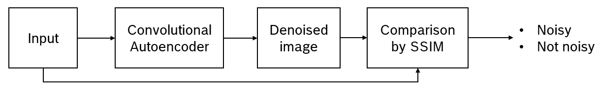
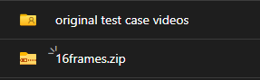
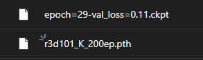

# Overview
This repository contains all code, data, documents and other files that I have created during my internship program from Jun 2023 to Nov 2023.

# Video noise detection
In July 2023, I worked on detecting visual noise and defects in video. My primary approach involved categorizing all video noise into 7 distinct groups and addressing each one individually. The 7 categories are:
  
- Impulse noise: Pixel-level noises
- Image glitch: horizontal or vertical glitches
- Blur
- Periodic noise: a good explanation can be found [here](https://en.wikipedia.org/wiki/Image_noise#Periodic_noise)
- Scratches & blotches: defects on old movies due to poor conditions in film strips preservation
- Freeze frame: some frames remain unchanged for a certain period
- Snow/TV static: see [this Wikipedia page](https://en.wikipedia.org/wiki/Noise_(video))

The topic was unfinished, since I was introduced to another project in August 2023. You can find all source code & data related to the first 3 categories in the folder VideoNoiseDetection.

## Impulse noise

<div align="justify">
The main idea is to denoise the original image to obtain a "cleaner" version using Deep Learning methods. Then, we compare these 2 images to calculate the difference, and choose a threshold value for classification.
</div><br>



- Architecture for the denoising stage: Convolutional Autoencoder
- Image comparison metric: [SSIM](#citation)
- Dataset: [SIDD](https://www.eecs.yorku.ca/~kamel/sidd/) (small and medium)
- Patchify: divide each image into patches, to increase size of dataset.

## Image glitch
Unfortunately, I did not manage to find any glitch image dataset. Therefore, I have resorted to artificially creating 100% glitched images from video frames extracted out of the UCF101. There are 2 main methods for creating glitches:
- [glitch_this's](https://github.com/TotallyNotChase/glitch-this) ImageGlitcher module
- My own implementation of glitching, including resizing and pixel shuffling

These new glitched frames are merged with the original frames, creating a balanced dataset consists of over 1000 frames.<br>
<div align="justify">
For this category, I decided to choose a vanilla CNN with 5 Conv2D layers and 3 linear layers. The model achieved over 90% accuracy, despite the simplicity of its architecture. However, since my data augmentation methods couldn't account for all real-world image glitches, the model struggled in many inference tests.
</div>

## Blur
<div align="justify">
  
I used the [Blur dataset](https://www.kaggle.com/datasets/kwentar/blur-dataset) from Kaggle for this particular category. During my research, I have managed to achieved good performance using Laplacian variance, and decided not to study further into this topic. The main idea is to calculate the variance of Laplacian on each image as a score. Laplacian is commonly used in edge detection tasks to show the regions in an image with rapid intensity change. After calculating the scores for every image, we simply choose the best value as a threshold for classifying an image as blurry or not.
</div>

# Flicker detection
<div align="justify">
I worked on this topic from August to the end of my internship program. After some discussions with the tester team from EMC2, I was granted access to all of CCS2BUG tickets to aid in my data collection process. During August, I have managed to gather 321 videos documenting the steps to reproduce failed test cases from more than 200 different tickets. These videos come in the form of camera records or screen capture.
</div><br>

Similar to the work of "Video noise detection", I divide all videos into these categories:

- Blank screen: all content on the screen disappear, leaving a monochrome screen (green, blue, black or white screen)
- Chaotic switch: switching screens causes the device to alternate screens chaotically during transitions. Happens for an extended period of time
- Frame error: very similar to a chaotic switch, but with screens alternating only twice and lasting for a much shorter duration
- List-slider: related to list or slider objects
- Object: related to particular objects on the screen (circles, boxes, icons,...)
- Screen slide: related to main screen sliding
- Other: cannot be classified into any of the above categories
<div align="justify">
  
All videos are categorized into these groups purely based on my observation of the flickers' patterns, the affected objects, the duration of each flicker, and similar factors. I firmly believe that establishing clear definitions for these categories should be a top priority.
</div><br>

I have attempted to solve the "Frame error" category during October and November 2023. All models that I have built can be found in the ```FlickerDetection/models``` directory.

# Documents
<div align="justify">
  
```doc/ticket categories.xlsx``` contains the results of flicker categorization according to the above definitions, as well as frame numbers pinpointing the exact starting point of each flicker, identified through manual inspection. The "Frame" column is not fully filled at present due to limited time on data labeling, and should eventually be completed if the project resumes in the future.</div><br>
```doc/ticket ID.xlsx``` contains the ID and summary for each flicker cases. This file can be used to refer back to all tickets posted on JIRA CCS2BUG.

# Examples
Folder ```examples``` contains examples of main.py scripts for different purposes. Before running these, copy them and paste in the root folder.

# Preparation

## Impulse noise
Download the [SIDD_Small_sRGB_Only](https://www.eecs.yorku.ca/~kamel/sidd/dataset.php) into ```VideoNoiseDetection/datasets/```

## Image glitch
Download the [UCF101](https://www.crcv.ucf.edu/data/UCF101.php) into ```VideoNoiseDetection/datasets/```. Then, copy ```tools/VideoNoiseDetection/extract ucf101 frames.ipynb``` and paste in ```VideoNoiseDetection/datasets/```. I have included some examples of cells on how to run the frame extraction functions, but one can also write their own.

## Blur
Download the [Blur dataset](https://www.kaggle.com/datasets/kwentar/blur-dataset) into ```VideoNoiseDetection/datasets/```

## Flicker detection
Refer to anh Bình for all checkpoints and data required to run this project.<br>


<div align="justify">

The data is organized into two main folders. One is the original data that I have collected, categorized and labeled. The names are supposed to be a short description for how the flickers would look like in the video. Before feeding these videos into the model, they need to be segmented into sequences of 16 frames per clip. All of these 16-frames clips can be found in the second folder `16frames`. The naming convention for these videos are ```16frames/video-name_start-frame_end-frame_label.mp4```. The label is either 0 or 1, representing whether the clip does not/does contain flicker, respectively.
</div><br>

<div align="justify">
  
Unzip ```16frames.zip``` to ```FlickerDetection/datasets``` before running the train process. Alternatively, one can store the data inside their preferred directory and specifies the path as argument of ```train()```.
</div><br>


<div align="justify">
  
```r3d101_K_200ep.pth``` is the pretrained model for ResNet3D-101, downloaded from this [repository](https://github.com/kenshohara/3D-ResNets-PyTorch). Please refer to this source for other pretrained versions if needed, as my Resnet3D backbone is also imported from here.</div><br>
```epoch=29-val_loss=0.11.ckpt``` is the pretrained version for my model, which can be loaded directly with the ```get_model()``` function. Please refer to ```examples``` for this.

# Citation

```bibtex
@ARTICLE{1284395,
  author={Zhou Wang and Bovik, A.C. and Sheikh, H.R. and Simoncelli, E.P.},
  journal={IEEE Transactions on Image Processing}, 
  title={Image quality assessment: from error visibility to structural similarity}, 
  year={2004},
  volume={13},
  number={4},
  pages={600-612},
  doi={10.1109/TIP.2003.819861}}
```

```bibtex
@INPROCEEDINGS{7894491,
  author={Bansal, Raghav and Raj, Gaurav and Choudhury, Tanupriya},
  booktitle={2016 International Conference System Modeling & Advancement in Research Trends (SMART)}, 
  title={Blur image detection using Laplacian operator and Open-CV}, 
  year={2016},
  volume={},
  number={},
  pages={63-67},
  doi={10.1109/SYSMART.2016.7894491}}
```

```bibtex
@misc{he2015deep,
      title={Deep Residual Learning for Image Recognition}, 
      author={Kaiming He and Xiangyu Zhang and Shaoqing Ren and Jian Sun},
      year={2015},
      eprint={1512.03385},
      archivePrefix={arXiv},
      primaryClass={cs.CV}
}
```

```bibtex
@misc{wang2018nonlocal,
      title={Non-local Neural Networks}, 
      author={Xiaolong Wang and Ross Girshick and Abhinav Gupta and Kaiming He},
      year={2018},
      eprint={1711.07971},
      archivePrefix={arXiv},
      primaryClass={cs.CV}
}
```

# Acknowledgement
Special thanks to anh Vinh, anh Bình, anh Đức, chị Phúc and Trinh for all of your support during my internship program <3 .
