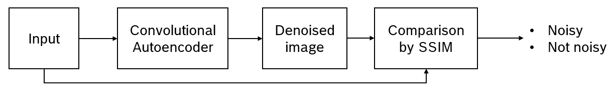

# Overview
This repository contains all code, data, documents and other files that I have created during my internship program from Jun 2023 to Nov 2023.

# Video noise detection
I worked on this topic in July 2023, solving the task of detecting visual noises and defects in video. My main approach was to categorize all video noises into 7 groups, and tackle them individually. The 7 categories are:
  
- Impulse noise
- Image glitch
- Blur
- Periodic noise
- Scratches & blotches
- Freeze frame
- Snow/TV static

The topic was unfinished, since I was introduced to another project in August 2023. You can find all source code & data related to the first 3 categories in the folder VideoNoiseDetection.

## Impulse noise

<div align="justify">
The main idea is to denoise the original image to obtain a "cleaner" version using Deep Learning methods. Then, we compare these 2 images to calculate the difference, and choose a threshold value for classification.
</div><br>



- Architecture for the denoising stage: Convolutional Autoencoder
- Image comparison metric: [SSIM](#citation)
- Dataset: [SIDD](https://www.eecs.yorku.ca/~kamel/sidd/) (small and medium)
- Patchify: divide each image into patches, to increase size of dataset.

## Image glitch
Unfortunately, I did not manage to find any glitch image dataset. Therefore, I have resorted to artificially creating 100% glitched images from video frames extracted out of the UCF101. There are 2 main methods for creating glitches:
- [glitch_this's](https://github.com/TotallyNotChase/glitch-this) ImageGlitcher module
- My own implementation of glitching, including resizing and pixel shuffling

I merged these new glitched frames with the original frames, creating a balanced dataset consists of over 1000 frames.<br>
<div align="justify">
For this category, I decided to choose a vanilla CNN, with 5 Conv2D layers and 3 linear layers. The model achieved > 90% accuracy, despite the simplicity of its architecture. However, since my data augmentation methods cannot cover all cases of real-world image glitches, the model failed a lot of inference tests.
</div>

## Blur
<div align="justify">
  
I used the [Blur dataset](https://www.kaggle.com/datasets/kwentar/blur-dataset) from Kaggle for this particular category. During my research, I have managed to achieved good performance using Laplacian variance, and decided not to study further into this topic. The main idea is to calculate the variance of Laplacian on each image as a score. Laplacian is commonly used in edge detection tasks to show the regions in an image with rapid intensity change. After calculating the scores for every image, we simply choose the best value as a threshold for classifying an image as blurry or not.
</div>

# Flicker detection
<div align="justify">
I worked on this topic from August to the end of my internship program. After some discussions with the tester team from EMC2, I was given access to all of CCS2BUG tickets. During August, I have managed to collect more than 200 videos recording steps to reproduce failed test cases. These videos come in the form of camera records or screen capture. 
</div><br>

Similar to the work of "Video noise detection", I divide all videos into 8 categories:

- Blank screen
- Chaotic switch
- Frame error
- List-slider
- Object
- Screen slide
- Unfeasible
- Other
<div align="justify">
All videos are categorized into these groups purely based on my observation on the flickers' patterns, which objects are bugged out, how long each flicker occurs,... I strongly believe that making clear definitions for these categories should be a task of high priority.</div><br>

I have attempted to solve the "Frame error" category during October and November 2023. All models that I have built can be found in the ```FlickerDetection/model``` directory.

# Preparation

## Blur
Download the [Blur dataset](https://www.kaggle.com/datasets/kwentar/blur-dataset) into ```VideoNoiseDetection/datasets/blur/```. The directory should look like this 

``` bash
├── datasets
│   └── blur
│       ├── blur_dataset.py
│       └── blur_dataset
│           ├── defocused_blurred
│           └── motion_blurred
│           └── sharp
```

# Citation

```bibtex
@ARTICLE{1284395,
  author={Zhou Wang and Bovik, A.C. and Sheikh, H.R. and Simoncelli, E.P.},
  journal={IEEE Transactions on Image Processing}, 
  title={Image quality assessment: from error visibility to structural similarity}, 
  year={2004},
  volume={13},
  number={4},
  pages={600-612},
  doi={10.1109/TIP.2003.819861}}
```

```bibtex
@INPROCEEDINGS{7894491,
  author={Bansal, Raghav and Raj, Gaurav and Choudhury, Tanupriya},
  booktitle={2016 International Conference System Modeling & Advancement in Research Trends (SMART)}, 
  title={Blur image detection using Laplacian operator and Open-CV}, 
  year={2016},
  volume={},
  number={},
  pages={63-67},
  doi={10.1109/SYSMART.2016.7894491}}
```

# Acknowledgement
Thank you anh Vinh, anh Bình, anh Đức, chị Phúc and Trinh for all of your support during my internship program.
